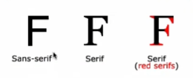

생활 코딩 CSS 강의 듣기

## CSS

```
li {
        color: red;
        text-decoration: underline;
      }
```

### 선택자

li : 선택자

id는 유니크한 값

class는 어떠한 대상의 관리하기 쉽도록 브로킹 하는 것

```
ul li {
        color: red;
      }
```

부모 선택자

선택자는 주어

### 가상클래스 선택자

```
a:active {
        color: green;
      }
      a:hover {
        color: yellow;
      }
```

hover는 마우스를 올려놓은 상태

마우스를 올려놓은 상태면 hover이면서 active한 상태입니다.

css는 뒤쪽 선언을 우선순위로 보여진다.

### font-size

px vs em vs rem

em, rem의 경우 사용자가 브라우저에 설정을 바꾸면
설정에 따라서 폰트의 크기가 달라진다.

rem 사용 권장
폰트크기를 조정할 수 있는 사용자의 권리

### text-align

```
text-align: justify
```

양쪽이 균등하게 분배된다.

```
 p {
        font-size: 5rem;
        font-family: arial, Verdana, Geneva;
      }
```

font- family에 ,를 사용하여 왼쪽부터 폰트가 존재하지 않으면 그 다음 폰트가 적용되게 됨.

serif vs sans serif

serif는 글꼴에서 사용하는 장식 의미.

sans는 부정의 표현



### cascading style sheet

cascading

웹 브라우저 html 해석을 하는 기계

html 기본적인 디자인 존재

user

author

서로 조화를 이뤄서 웹을 만들어가는 철학을 만들기 위해 만든 것이 cs

대가는 우선 순위
웹 브라우저의 기본 디자인
사용자도 원하는 디자인
컨텐츠를 생산하는 디자인

우선순위
웹브라우저 < 사용자 < 저자

```
<!DOCTYPE html>
<html lang="en">
  <head>
    <meta charset="UTF-8" />
    <meta name="viewport" content="width=device-width, initial-scale=1.0" />
    <title>Document</title>
    <style>
      li {
        color: red;
      }
      #idsel {
        color: blue;
      }
      .classsel {
        color: green;
      }
    </style>
  </head>
  <body>
    <ul>
      <li>html</li>
      <li id="idsel" class="classsel" style="color: powderblue">css</li>
      <li>javascript</li>
    </ul>
  </body>
</html>

```

태그선택자 < class 선택자 < id 선택자< 인라인

!important를 사용하면 우선순위를 맨 위로 끌어올리게 된다.

```
  h1,
      a {
        border: 1px soild red;
      }
    </style>
  </head>
  <body>
    <h1>Hello world</h1>
    안녕하세요. <a href="">반가워요.</a>
  </body>
```

a는 inline level 전체 길이를 사용

h1은 block level 지정한 공간만큼 사용

### box model

inline에서는 width값과 height값이 무시됨.

### box sizing

content의 영역의 크기를 width로 지정하기로 했음

box-sizing의 기본 사이징 context-box
content의 크기만 width와 height가 적용

border-box border의 두께가 다름에도 경계가 예측하기 쉬워졌다.

```
 * {
      box-sizing: border-box;
    }
```

기본적으로 많이 사용함.

### 마진 겹침

두 태그 사이에서 더 큰 값이 두 태그의 간격이 된다

부모가 시각적으로 아무런 표시가 없으면 자식 태그와 부모태그의 margin 값이 합쳐지는 결과 값이 나옴

부모 element가 시각적으로 투명한 상태일때
부모 element의 margin 값과 자식 element의 margin 값 중에 큰 쪽에 margin 값이 자식 margin 값으로 사용된다.

### position

```
 #me {
        position: relative;
        left: 100px;
        top: 100px;
        /* offset */
      }
```

css의 기본 position 값은 static
offset 값을 무시
원래 위치해야할 곳에 정적으로 존재
자기가 있어야하는 위치를 기준으로 상대적으로 움직이고 싶다면
position:relative

우선 순위
top > bottom

left > right

absolute는 html의 위치를 기준으로 자리가 잡힘.
absolute는 더이상 부모 소속이 아니고 크기를 직접 지정해주어야 한다.
left: 0,top: 0 offset값이 존재하지 않는다면 부모 element의
위치를 기반으로 자기 위치가 생긴다.
부모의 위치가 기본값인 static이 아닌 relative가 되는 순간 html이 아닌 relative의 위치를 기준으로 자신의 offset값을 설정하게됨

fixed는 스크롤로부터 완전히 독립되게 만든다.

### flex

flex의 기본값은 row;
flex-direction은 column을 사용하여 배치를 세로로 정렬
flex-basis는 flex의 방향에 따른 크기를 지정
flex-grow:1을 했을 경우 item의 각각 요소에 n/1로 나눠서 갖는다.
flex-grow에 값에 따라 해당하는 여백의 값을 가져감.
flex-shrink는 컨테이너의 크기가 작아졌음에도 불구하고 flex-basis에 값이 있더라도 줄어들지 않는다.
align-itmes item 전체를 정렬
align-content 같은 행 그룹과 그룹의 사이를 결정
order는 flex로 이루어진 item의 위치를 내가 원하는 위치로 지정하여 보여줄 수 있다.

### multi column

```
column-count:2;
```

엄청 큰 문장을 세로로 영역을 나눠어 읽기 쉽게 보여준다
count의 갯수만큼 세로로 영역이 생김
count의 갯수보다 더 많이 영역이 생기지는 않는다.

```
 column-width: 200px;

```

세로 영역에 폭이 나오고 웹을 줄이면 컬럼에 수가 줄어든다.

```
column-gap:100px;

```

column의 영역의 폭을 지정할 수 있다.

```
        column-rule-style: solid;
        column-rule-width: 1px;
        column-rule-color: red;

```

column 영역마다 style에 맞는 선이 생기고 선의 굵기고 선의 색깔 지정할 수 있다.

```
        column-span: all;

```

해당 대상은 column의 영역을 벗어나서 배치되게 된다.

### Media query

```
    <style>
      @media (max-width: 500x) {
        body {
          background-color: red;
        }
      }
    </style>
```

max-width는 최대 500px이하일때는 빨간색

min-width는 최소
500px이상일대는 빨간색

### background

```
        background-attachment: fixed;

```

background-attachment: fixed를 사용하면 scroll시에도 백그라운드 이미즈는 스크롤 되지 않는다.
